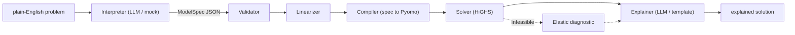

# Formulate

**Plain-English business problems in. Solved, explained optimization models out.**

[](https://github.com/Rishabh-792/formulate/actions/workflows/ci.yml)


Formulate turns a paragraph like *"we make three products on two machines,
maximize profit"* into a typed, validated model specification, compiles that
spec into a Pyomo model, solves it with an open-source solver, and hands back
a plain-English answer.

The design bet is simple: **LLMs at the boundary, a typed contract in the
middle, a deterministic compiler at the core.** The language model only ever
produces a `ModelSpec` — a pydantic document with a closed expression
grammar. Everything after that document is ordinary, unit-tested code. The
LLM cannot write code, cannot call a solver, and cannot hallucinate anything
the validator will not catch as data. Delete the LLM entirely (no API keys)
and the whole pipeline still runs against bundled specs — that is the mode
the test suite runs in.



## A worked example, end to end

**You type** (see `examples/production_planning.md`):

> Meridian Woodworks builds chairs, tables, and desks. Every product passes
> through two machines: cutting and assembly. A chair needs 1 cutting hour
> and 2 assembly hours; a table needs 3 and 2; a desk needs 2 and 3. Cutting
> has 160 hours per week, assembly has 250. Profit per unit: 25 chair, 110
> table, 75 desk. The market absorbs at most 100 chairs, 20 tables, 30
> desks. Maximize weekly profit.

**The interpreter emits a ModelSpec** (excerpt):

```json
{
  "variables": [
    {"name": "make", "indexed_by": ["P"], "domain": "continuous", "lower": 0.0}
  ],
  "constraints": [
    {
      "name": "machine_capacity",
      "forall": [{"index": "m", "over": "M"}],
      "expr": "sum(p in P, hours[p,m] * make[p]) <= capacity[m]"
    }
  ],
  "objective": {"sense": "maximize", "expr": "sum(p in P, profit[p] * make[p])"}
}
```

**The compiler emits (and executes) Pyomo** (excerpt of `emit_pyomo_source`):

```python
m.make = pyo.Var(m.P, domain=pyo.Reals, bounds=(0.0, None))

def machine_capacity_rule(m, m_idx):
    return sum((m.hours[p, m_idx] * m.make[p]) for p in m.P) <= m.capacity[m_idx]
m.machine_capacity = pyo.Constraint(m.M, rule=machine_capacity_rule)

m.objective = pyo.Objective(expr=sum((m.profit[p] * m.make[p]) for p in m.P), sense=pyo.maximize)
```

**HiGHS solves it:**

| variable | value |
|---|---|
| make[chair] | 40 |
| make[table] | 20 |
| make[desk]  | 30 |
| **objective** | **5450** |

**The explainer answers:**

> Optimal plan found. It maximizes total weekly profit at a value of
> 5,450.00. Build 40 chairs, 20 tables, and 30 desks. Tables and desks sell
> out; the cutting machine is the bottleneck while assembly has 40 hours to
> spare.

That optimum is derived by hand in `examples/production_planning.md` and
asserted in `tests/test_compile_solve.py` — if the compiler ever miscompiles,
CI fails with a number, not a vibe.

## Quickstart

### Keyless demo (no accounts, no API keys)

```bash
pip install -r requirements.txt
python -m formulate.pipeline examples/production_planning.spec.json
python -m formulate.pipeline --text "Ship pallets from two plants to three warehouses at minimum cost"
```

The second command exercises the mock interpreter, which recognizes the two
bundled example problems. HiGHS ships as a Python wheel (`highspy`), so there
is nothing to apt-install.

### API and UI

```bash
uvicorn api.main:app --reload      # http://localhost:8000/docs
streamlit run ui/app.py            # textarea -> spec -> model -> solution
docker compose up --build          # both at once
```

### Azure mode (real natural-language interpretation)

Copy `.env.example` to `.env` and fill in the four Azure OpenAI values.
Mode is auto-detected: with keys present the interpreter and explainer call
the API; without them the mocks take over. `infra/main.tf` stands up the
minimal cloud footprint (App Service, OpenAI deployment, Key Vault, Log
Analytics).

## API reference

| Method | Path | Body | Returns |
|---|---|---|---|
| GET | `/healthz` | — | status, version, mode |
| GET | `/examples` | — | bundled ModelSpecs by name |
| POST | `/interpret` | `{"problem": "..."}` | ModelSpec |
| POST | `/validate` | ModelSpec | ValidationReport |
| POST | `/compile-and-solve` | ModelSpec | full artifact bundle |
| POST | `/solve` | `{"problem": "..."}` | full artifact bundle (one-shot) |

The artifact bundle contains the spec, validation report, linearization
notes, generated Pyomo source, solution, and explanation — every
intermediate the pipeline produced.

## Expression grammar (the whole thing)

```
constraint := expr ("<=" | ">=" | "==") expr
expr       := term (("+" | "-") term)*
term       := factor (("*" | "/") factor)*
factor     := "-" factor | atom
atom       := NUMBER
            | "sum" "(" IDENT "in" IDENT "," expr ")"
            | "abs" "(" expr ")"
            | IDENT ("[" IDENT ("," IDENT)* "]")?
            | "(" expr ")"
```

Small on purpose: an LLM emits it reliably, a ~150-line recursive-descent
parser covers it completely, and the AST round-trips (`parse(unparse(x)) ==
x`), which is what lets the linearizer and the infeasibility diagnostic
rewrite models safely. `abs()` parses but deliberately does not compile —
the linearizer must rewrite it first, so stage order is enforced by
construction. Details and the extension guide: `docs/architecture.md`.

## What happens when the model is infeasible

Formulate does not just say "infeasible". It re-solves an **elastic
relaxation** — every constraint gets a nonnegative slack, the objective
becomes *minimize total slack* — and reports the constraints with nonzero
slack: the smallest total change that would make the problem solvable.

```
model is infeasible — smallest total relaxation: total_capacity must be relaxed by 20
```

## Configuration

| Variable | Default | Effect |
|---|---|---|
| `AZURE_OPENAI_ENDPOINT` | — | with the next two, switches mode to `azure` |
| `AZURE_OPENAI_API_KEY` | — | " |
| `AZURE_OPENAI_DEPLOYMENT` | — | chat deployment name |
| `AZURE_OPENAI_API_VERSION` | `2024-10-21` | API version |
| `FORMULATE_SOLVER` | auto | force `appsi_highs`, `cbc`, or `glpk` |
| `FORMULATE_LOG_LEVEL` | `INFO` | structured logging level |

## Testing

```bash
pip install -r requirements-dev.txt
pytest -q
ruff check .
```

**59 tests, 89% line coverage, 2.5 s, no API keys.** The suite covers the
parser (round-trips, rejection cases), the validator (one test per defect
class), both linearization transforms (structure *and* solved optima), the
compiler and solver end to end, the elastic infeasibility diagnostic, and the
API. CI runs all of it keyless on every push, across Python 3.11/3.12/3.13.

## Correctness benchmark

Tests can only check the engine against itself. The benchmark checks it
against **exhaustive enumeration in plain Python** — an oracle that never
calls Pyomo or HiGHS, so agreement is evidence of correctness rather than of
self-consistency.

```bash
python -m bench.run_benchmark
```

| Problem | Exercises | Optimum | Oracle | Error |
|---|---|---:|---|---:|
| knapsack | binary domain, scalar param | 196 | 2^8 = 256 subsets | 0.00e+00 |
| assignment | 2-D param, equality, nested sum | 11 | 4! = 24 permutations | 0.00e+00 |
| set_cover | 0/1 incidence, `>=` | 28 | 2^6 = 64 subsets | 0.00e+00 |
| integer_production | integer domain, upper bounds | 900 | 2,197 grid points | 0.00e+00 |
| abs_deviation | **abs() epigraph transform** | 5 | 14,641 rosters | 0.00e+00 |

**5/5 exact (max absolute error 0.00e+00), median end-to-end pipeline latency
37 ms.** Full results, including per-problem timings and the transforms each
one triggered, are committed to [`bench/results.json`](bench/results.json) and
regenerated by CI, which fails if any problem misses its enumerated optimum.

The benchmark earned its keep immediately: `abs_deviation` exposed a bug in
the linearizer. `abs()` inside a `sum(d in D, ...)` emitted a single *scalar*
epigraph variable whose constraints referenced the sum's bound index, which
the validator rejected outright — so every model minimizing a sum of absolute
deviations was unsolvable. The transform now carries enclosing index bindings
onto both the epigraph variable and its constraints. Two regression tests pin
the indexed and scalar paths.

## Roadmap

- More linearization transforms: McCormick envelopes for bilinear terms,
  piecewise-linear costs (SOS2), indicator constraints.
- Sensitivity analysis: duals and reduced costs surfaced through the
  explainer ("one more cutting hour is worth 35").
- Robust and stochastic scenarios: scenario sets in the spec, deterministic
  equivalent generation in the compiler.
- Iterative repair loop: feed validation errors back to the interpreter for
  one bounded self-correction round.

## License

MIT — see `LICENSE`.
