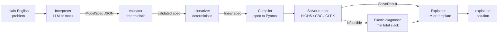

# Formulate architecture

## The pipeline



## The typed-contract argument

An LLM that writes solver code directly is untestable: every run is new
code, every hallucination is a runtime surprise, and there is no seam at
which to assert correctness. Formulate moves the LLM to the **boundary**
and puts a typed contract — `ModelSpec`, a pydantic document with a
closed expression grammar — in the middle. Consequences:

1. **The LLM's entire output surface is data, not code.** It cannot
   import anything, call anything, or produce an expression outside the
   grammar. The worst it can do is emit a wrong *model*, and wrong models
   are exactly what the validator and the solver's infeasibility
   diagnostic are built to surface.
2. **Everything downstream of the spec is deterministic and unit-tested.**
   The compiler is ordinary code with fixed inputs and outputs; the two
   bundled examples solve to hand-derived optima in CI on every commit.
3. **The seam is inspectable.** Users see the spec JSON before it is
   solved; a domain expert can review or hand-edit it. The same spec can
   be re-solved forever without an LLM in the loop.
4. **Mocks are first-class.** Because the contract is data, the mock
   interpreter just returns fixture documents — the demo, the tests, and
   the UI exercise the identical deterministic path Azure mode uses.

## Expression grammar

Constraints and objectives are strings in a closed grammar, parsed by a
recursive-descent parser in `formulate/spec.py` (~150 lines, no
dependencies):

```
constraint := expr ("<=" | ">=" | "==") expr
expr       := term (("+" | "-") term)*
term       := factor (("*" | "/") factor)*
factor     := "-" factor | atom
atom       := NUMBER
            | "sum" "(" IDENT "in" IDENT "," expr ")"
            | "abs" "(" expr ")"
            | IDENT ("[" IDENT ("," IDENT)* "]")?
            | "(" expr ")"
```

Design choices:

- **No comparison operators inside expressions** — a constraint is
  exactly one relation, so chained or nested comparisons cannot exist.
- **Indices are identifiers only** (bound `sum`/`forall` indices or
  literal set members), never arbitrary expressions; index arithmetic is
  a deliberate non-goal until a use case demands it.
- **`abs` is in the grammar but not in the compiler.** The parser accepts
  it, the linearizer rewrites it, and the compiler rejects it — enforcing
  stage order by construction.
- The AST round-trips: `parse(unparse(ast)) == ast`, which is what lets
  the linearizer and the elastic diagnostic rewrite specs as strings.

## Validator

`validator.py` resolves every symbol in every expression against the
declarations: unknown names, index arity, index-vs-set mismatches, literal
members that are not in the indexed set, param tables missing (or carrying
extra) keys, degenerate variable bounds, constant constraints and
objectives, duplicate names. It returns a `ValidationReport` of all issues
at once rather than failing on the first, because the report is shown to a
human whose next step is editing the spec (or re-prompting the LLM with
the errors).

## Linearizer

`linearize.py` walks each expression AST and applies registered rewrites,
emitting auxiliary variables and constraints back into the spec — so the
compiler never sees a nonlinear node:

| Pattern | Rewrite | Status |
|---|---|---|
| binary x continuous | big-M: `z <= M*b`, `z <= x`, `z >= x - M*(1-b)` | implemented |
| `abs(e)` in convex position | epigraph: `t >= e`, `t >= -e` | implemented |
| continuous x continuous | McCormick envelopes | roadmap |
| piecewise-linear cost | SOS2 / lambda formulation | roadmap |
| indicator constraints | big-M or solver-native indicators | roadmap |

Convexity is tracked structurally during the walk: `abs` is only accepted
in a minimized objective or on the `<=` side of a constraint, and only
when reached through `+`; anything else raises `LinearizationError` with
the location.

Because transforms write ordinary spec fragments, their output is
re-validated by the same validator that guards the LLM — the linearizer
gets no private backdoor into the compiler.

## Infeasibility diagnostic

When the solver reports infeasible, `solve.py` builds an **elastic
relaxation** of the spec: every constraint gains a nonnegative slack
variable (`<=` gets one on the right, `>=` on the left, `==` gets both
directions), and the objective becomes *minimize total slack*. The relaxed
model is feasible by construction; the constraints whose slack is nonzero
at its optimum form a minimal-total-violation certificate — "these are the
requirements that cannot all hold, and by how much." That is not a formal
IIS, but it answers the user's actual question ("what should I relax?") in
one extra solve.

## Extending Formulate

- **New linearization**: add a detection + rewrite method to `_Rewriter`
  in `linearize.py`, emit spec-level vars/constraints, append a
  `TransformNote`. Re-validation is automatic in the pipeline.
- **New validator rule**: append checks in `validator.py`; return issues,
  never raise mid-walk.
- **New solver**: add its Pyomo plugin name to `_SOLVER_PREFERENCE` in
  `solve.py`.
- **New grammar node**: extend the tokenizer/parser/`unparse` in
  `spec.py`, then teach *both* the validator walk and the compiler
  `_eval`/`_py` walks about the node — the exhaustive `isinstance`
  chains fail loudly on unknown nodes, so a missed walk is caught by the
  first test that uses the new syntax.
